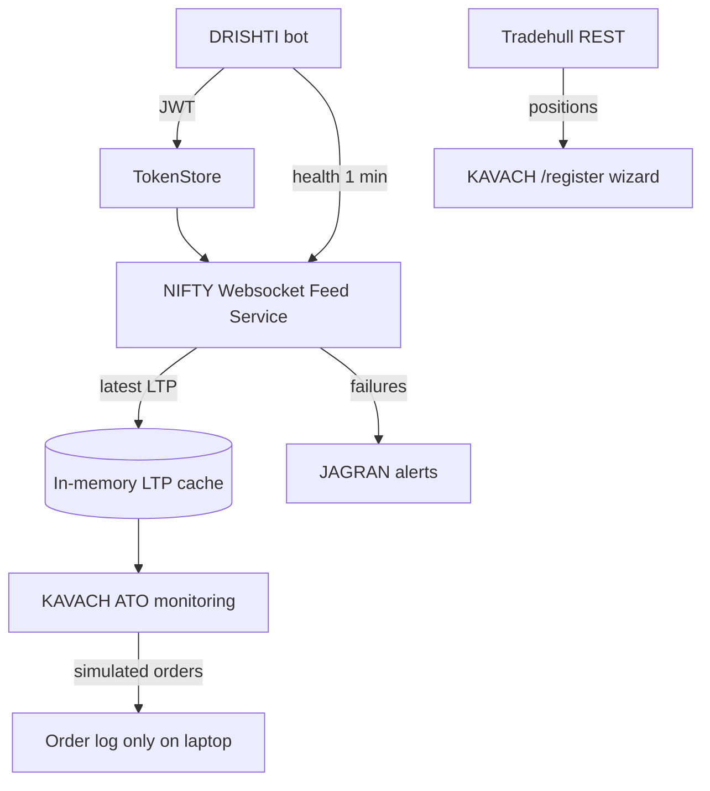

# Phase 1 — Dhan API & NIFTY LTP Integration Notes

Last updated: 2026-05-29  
Owner: Rahul

> Reference for wiring DRISHTI + KAVACH ATO to live NIFTY LTP on laptop dev.

---

## 1. Official documentation

| Resource | URL |
|----------|-----|
| DhanHQ docs (home) | https://dhanhq.co/docs/v2/ |
| **Batman API context (scoped reference)** | `DHAN_API_CONTEXT.md` |
| NIFTY LTP ownership policy | `NIFTY_LTP_POLICY.md` |
| Live market feed | https://dhanhq.co/docs/v2/live-market-feed |
| Orders | https://dhanhq.co/docs/v2/orders/ |
| Portfolio / positions | https://dhanhq.co/docs/v2/portfolio/ |

---

## 2. Operator-provided working reference code

**Path:**  
`Dhan/Fetch LTP Working Code 09 Apr 26/NIFTY LTP With Access token only 09 Mar 26/`

**Status:** Verified working on operator laptop (Mar–Apr 2026). Uses **access token only** (no PIN/TOTP).

### Key files

| File | Role |
|------|------|
| `app/services/ltp_service.py` | Fetch one NIFTY tick via websocket feed |
| `app/context/trading_context.py` | Creates `dhanhq` MarketFeed v2 |
| `app/config/settings.py` | Loads `client_id.txt` + `token.txt` |
| `config/settings.json` | NIFTY instrument constants |

### NIFTY index instrument (LOCKED from reference)

| Field | Value | Meaning |
|-------|-------|---------|
| `exchange_segment` | **0** | Index segment |
| `security_id` | **13** | NIFTY 50 security ID on Dhan |
| `request_code` | **15** | Feed request type (Ticker/LTP in v2 feed) |
| `default_symbol` | **NIFTY** | Label only |

### SDK used in reference project

- Package: **`dhanhq==2.2.0rc1`**
- Websocket endpoint (from dhanhq library): `wss://api-feed.dhan.co`
- Auth: `client_id` + `access_token` (JWT from DRISHTI)

### How reference app fetches LTP

1. Build instrument tuple: `(exchange_segment, security_id, request_code)`
2. Create `MarketFeed` / `DhanFeed` with v2
3. `connect()` → `get_instrument_data()` → read `LTP` from tick
4. `disconnect()` after each fetch
5. Retry with exponential backoff (default 3 retries)

**Note for Batman:** Reference polls every **10–15 seconds** with connect/disconnect per tick. Batman ATO target is **1 second** — implementation should use a **persistent websocket thread** feeding an in-memory LTP cache (not reconnect every second).

---

## 3. Batman v3 current state vs target

| Capability | Batman today | Phase 1 target |
|------------|--------------|----------------|
| Auth | JWT via DRISHTI → `TokenStore` → `BatmanBroker` | Same |
| NIFTY LTP | **DRISHTI sole collector** → shared cache; KAVACH/ATO read only | **`NIFTY_LTP_POLICY.md`** |
| NIFTY LTP backup | Runtime WS→REST failover in DRISHTI | Session lock; config unchanged |
| Positions | REST `get_positions()` via Tradehull | **Keep REST** — read live positions for `/register` |
| Orders (laptop dev) | Mock guard / live mode | **Simulated only** — log, do not send |
| GIFT NIFTY validation | DRISHTI dual-check on token save | Derive from Dhan docs (EQ-02) |

### SDK note

- Batman main project: `Dhan-Tradehull>=3.2.0` in `requirements.txt`
- Reference LTP project: `dhanhq==2.2.0rc1` direct
- **Integration approach:** Add `dhanhq` market feed alongside Tradehull for LTP websocket; keep Tradehull for positions until unified SDK decision.

---

## 4. Proposed architecture (approval pending — no code yet)

### DRISHTI responsibilities (feed layer)

- Start/stop websocket feed when token hot-reloaded
- Expose latest NIFTY LTP + last tick timestamp to ATO thread
- Every **1 minute:** verify feed alive; alert JAGRAN on sustained failure (per `JAGRAN_ERROR_MATRIX.md` websocket ≥5 retries)

### KAVACH / ATO responsibilities

- Read LTP from cache every **1 second** (poll interval)
- Breach/retrace logic unchanged
- On laptop dev: log simulated BUY/SELL protect orders

---

## 5. Dev testing sequence (operator plan)

1. Send JWT to **DRISHTI** (same as production flow)
2. Verify websocket NIFTY LTP updating (~1s) on laptop
3. Verify **live positions** readable from Dhan API (read-only)
4. Run KAVACH `/register` against real positions
5. Simulate ATO breach/retrace with **simulated orders**
6. VPS + live orders only after dev stable + static IP

---

## 6. Related project files

| File | Purpose |
|------|---------|
| `PHASE1_REQUIREMENTS.md` | Operator requirements |
| `PHASE1_OPEN_QUESTIONS.md` | Remaining questions |
| `JAGRAN_ERROR_MATRIX.md` | Websocket drop → JAGRAN escalation rules |
| `core/nifty_ltp.py` | On-demand NIFTY LTP (websocket v2 + REST fallback) — **implemented 2026-05-29** |
| `core/positions.py` | Dhan positions fetch + filter + ATO symbol builder — **implemented 2026-05-29** |
| `core/broker.py` | Current REST broker wrapper |
| `core/token_store.py` | Persisted JWT |

---

*Update when websocket is integrated into Batman or when Dhan SDK version is unified.*
