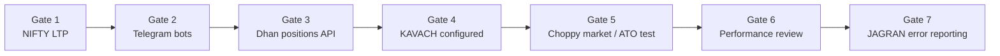

# Phase 1 Implementation Plan & Progress Tracker

Last updated: 2026-05-29 (KAVACH register complete — laptop restart handoff)  
Owner: Rahul

> **Rule:** Update status after each session. Requirements: `PHASE1_REQUIREMENTS.md`. Daily notes: `PHASE1_DAILY_LOG_YYYY-MM-DD.md`.

---

## Operator rollout sequence (LOCKED — gradual, step by step)

We move forward **one gate at a time**. Do not skip ahead until the current gate has evidence (pass/fail logged).



| Gate | Target | Success looks like |
|------|--------|-------------------|
| **1** | **Fetch NIFTY LTP** | Stable live LTP via Dhan websocket during market hours; logged evidence |
| **2** | **Telegram bots working** | DRISHTI, KAVACH, JAGRAN respond; token flow via DRISHTI works |
| **3** | **Fetch positions from Dhan** | Live open positions readable via API; reliability noted (latency, failures) |
| **4** | **KAVACH configured** | `/register` wizard, weekly legs stored, daily 09:25 Yes/No, settings applied |
| **5** | **Choppy / user-triggered ATO test** | When market moves or user triggers, configured buffer/retrace/poll behave as expected (simulated orders on laptop) |
| **6** | **Performance review** | Poll interval, feed lag, stability under session — tune config |
| **7** | **JAGRAN error reporting** | Failures during all above gates surface in JAGRAN; `/recent` useful |

**Environment:** Laptop dev · read-only broker · **simulated orders** · JWT ~24h · VPS later.

---

## Progress dashboard

| Gate | Name | Progress | Status |
|------|------|----------|--------|
| — | Requirements & discovery (Day 1) | **98%** | ✅ Done |
| **1** | NIFTY LTP fetch | **~60%** | 🟡 On-demand PASS; persistent feed pending |
| **2** | Telegram bots | **~85%** | 🟡 All 3 PASS · `main.py` not smoke-tested |
| **3** | Dhan positions API | **~80%** | 🟡 Live fetch PASS · `scripts/fetch_positions.py` |
| **4** | KAVACH configured | **~70%** | 🟡 Wizard + armed deployment · ATO module pending |
| **5** | ATO / choppy market test | **0%** | Blocked on ATO module wiring |
| **6** | Performance review | **0%** | Blocked on Gate 5 |
| **7** | JAGRAN errors | **0%** | Blocked on Gate 5–6 |

**Overall Phase 1 delivery:** ~**55%** (DRISHTI + KAVACH register complete)

---

## Gate 1 — NIFTY LTP

| # | Task | Status | Evidence |
|---|------|--------|----------|
| 1.1 | Reference app LTP smoke (market hours) | ✅ | Websocket PASS ~₹23,879–23,906 IST 2026-05-29 |
| 1.2 | Log pass/fail in daily log | ✅ | PHASE1_DAILY_LOG_2026-05-30.md |
| 1.3 | On-demand LTP in Batman (`core/nifty_ltp.py`) | ✅ | Drishti Nifty LTP button + tests |
| 1.4 | Persistent websocket feed (1s cache for ATO) | ⬜ | Next after KAVACH tokens |
| 1.5 | 1-min DRISHTI health on feed | 🟡 | Hourly monitor uses websocket; 1-min TBD with persistent feed |
| 1.6 | Stable run 30+ min (Gate 6 preview) | ⬜ | |

**Reference:** `PHASE1_DHAN_INTEGRATION.md`

---

## Gate 2 — Telegram bots

| # | Task | Status | Evidence |
|---|------|--------|----------|
| 2.1 | `token.env` for DRISHTI, KAVACH, JAGRAN | ✅ | All 3 configured · `phase1_bot_check.py` PASS |
| 2.2 | `python main.py` — 3 bots poll without crash | ⬜ | Next after laptop restart smoke |
| 2.3 | DRISHTI: JWT → validate LTP → save → alive menu | ✅ | `@Drishti_Infrabot` |
| 2.4 | KAVACH: `/start`, button menu, `/register` | ✅ | `@kavach_ATO_Bot` · wizard complete 2026-05-29 |
| 2.5 | JAGRAN: test incident delivery | ⬜ | Tokens ready · standalone pending |
| 2.6 | Comment out LAKSHMI; trim fleet display to 3 bots | ⬜ | |
| 2.7 | Dev bot check script | ✅ | `scripts/phase1_bot_check.py` |

---

## Gate 3 — Dhan positions API

| # | Task | Status | Evidence |
|---|------|--------|----------|
| 3.1 | Fetch open positions with live JWT | ✅ | 4 NIFTY legs · REST fallback |
| 3.2 | Log reliability: success rate, latency, errors | 🟡 | `fetch_positions.py` + daily log |
| 3.3 | KAVACH `/register` reads positions for leg pick | ✅ | Rahul completed wizard 2026-05-29 |
| 3.4 | Confirm fail if legs mismatch broker | ⬜ | |

---

## Gate 4 — KAVACH configured

| # | Task | Status | Evidence |
|---|------|--------|----------|
| 4.1 | `/register` wizard (keep buffer/retrace/poll prompts) | ✅ | Full flow PASS |
| 4.2 | Confirm → start ATO + startup scan | 🟡 | Deployment armed · ATO module not wired in standalone |
| 4.3 | Daily 09:25 Yes/No; end 15:15 | ⬜ | AlgoScheduler |
| 4.4 | Pause/resume full stop; batman_complete cleanup | ⬜ | |
| 4.5 | Simulated order mode (no live sends) | ⬜ | |
| 4.6 | Remove `/exit`, break-even, calendar steps | ⬜ | |

---

## Gate 5 — Choppy market / user-triggered ATO test

| # | Task | Status | Evidence |
|---|------|--------|----------|
| 5.1 | Simulate or observe breach → protect BUY (simulated) | ⬜ | |
| 5.2 | Retrace → protect SELL (simulated) | ⬜ | |
| 5.3 | Verify defaults: buffer 0, retrace 5, poll 1s, both sides, 50pt step | ⬜ | |
| 5.4 | User pause/resume during movement — fresh LTP evaluation | ⬜ | |
| 5.5 | KAVACH notifications on trigger/exit | ⬜ | |

---

## Gate 6 — Performance review

| # | Task | Status | Evidence |
|---|------|--------|----------|
| 6.1 | Measure LTP tick age vs 1s poll | ⬜ | |
| 6.2 | Websocket drop/reconnect behavior | ⬜ | |
| 6.3 | Tune config if needed (poll, health interval) | ⬜ | |
| 6.4 | pytest still green | ⬜ | |

---

## Gate 7 — JAGRAN error reporting

| # | Task | Status | Evidence |
|---|------|--------|----------|
| 7.1 | LTP/broker failures → JAGRAN (per error matrix) | ⬜ | |
| 7.2 | Order sim failures / rejections logged + JAGRAN | ⬜ | |
| 7.3 | Crash → JAGRAN + halt (no auto-resume) | ⬜ | |
| 7.4 | `/recent` shows incident history | ⬜ | |
| 7.5 | Review errors found during Gates 1–6 | ⬜ | Daily log |

---

## What we achieved (Day 1 — 2026-05-29)

| Done | Detail |
|------|--------|
| ✅ | Full Phase 1 requirements Q&A (~98%) |
| ✅ | 3-bot scope locked (DRISHTI, KAVACH, JAGRAN) |
| ✅ | Weekly register + daily 09:25 ATO gate documented |
| ✅ | Dhan docs + working LTP reference code reviewed |
| ✅ | JWT in gitignored config; REST fundlimit validated |
| ✅ | Doc suite: requirements, open questions, integration notes, daily logs |
| ✅ | DRISHTI Telegram validated; UI restored; `run_drishti.py` running |
| ✅ | Dev scripts: `phase1_bot_check.py`, `send_drishti_alive.py` |
| ⬜ | Gate 1 not passed (off-hours LTP smoke failed ×2) |
| ⬜ | Gate 2 incomplete (KAVACH + JAGRAN tokens) |

---

## Config targets (when implementing)

```json
"operations": {
  "algo_start_time": "09:25",
  "algo_end_time": "15:15",
  "order_mode": "simulate"
}
```

---

## Session logs

| Date | File |
|------|------|
| 2026-05-29 | `PHASE1_DAILY_LOG_2026-05-29.md` |
| 2026-05-30 | `PHASE1_DAILY_LOG_2026-05-30.md` (Day 2 start) |

---

*Update gate status after each working session. One gate at a time.*
