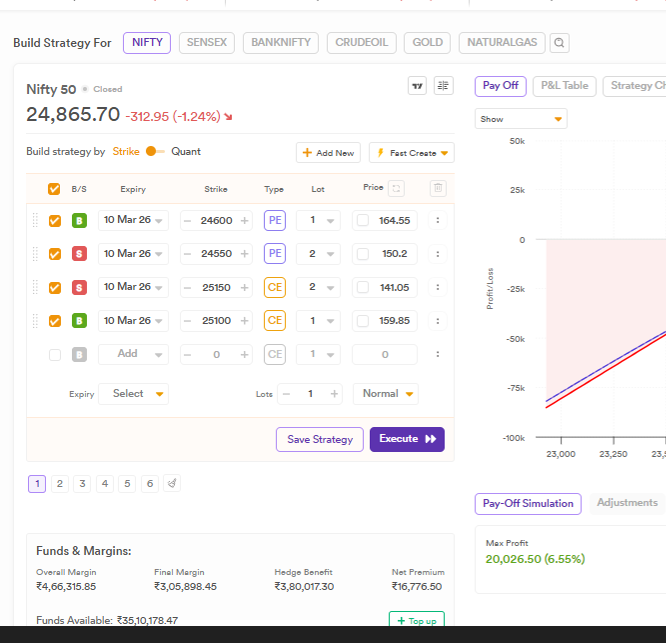
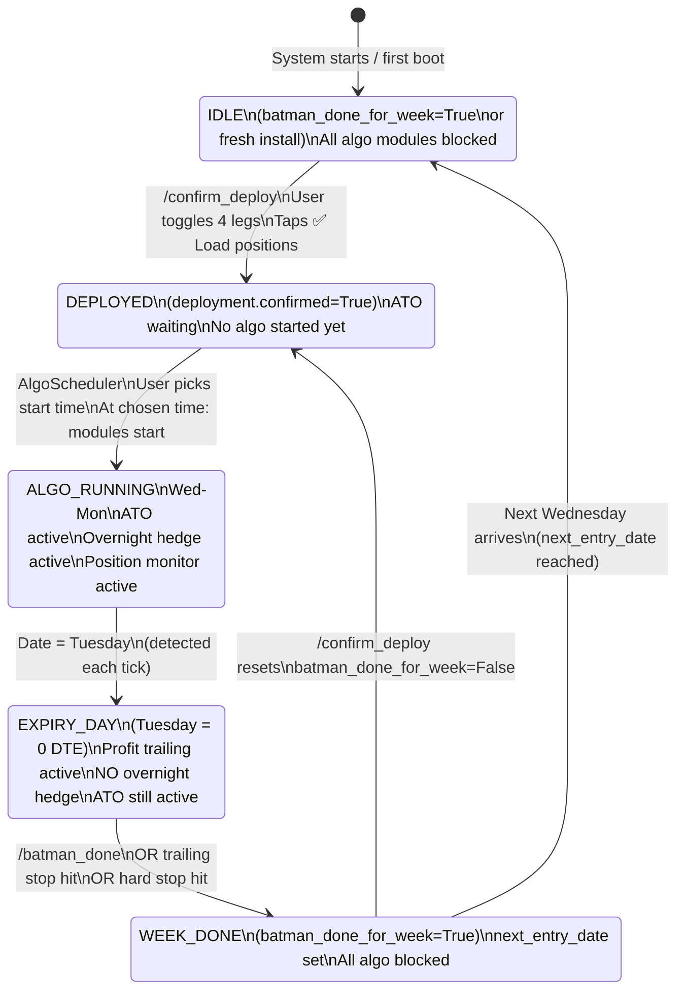
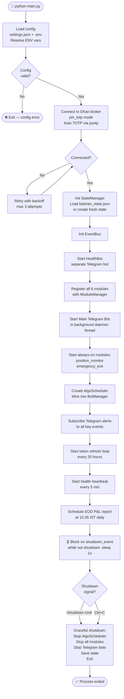

# Batman v3 — Master Flowchart & Scenario Design

> **Purpose:** This is the single source of truth for system behaviour, decision logic, and all scenarios.
> Every code change must be validated against this document first.
> Last Updated: 2026-03-14

---

## Design Decisions — LOCKED

> These are closed. Do not re-open without explicit reason.

| #   | Decision                                         | Detail                                                                                                                                                                                              |
| --- | ------------------------------------------------ | --------------------------------------------------------------------------------------------------------------------------------------------------------------------------------------------------- |
| D1  | **Expiry always = nearest Tuesday (`Expiry=0`)** | NIFTY monthly expiry also falls on Tuesday — no special monthly logic needed. `Expiry=0` always means nearest expiry. NSE holiday calendar handles any shift (e.g. Monday if Tuesday is a holiday). |
| D2  | **`batman_entry` module is OUT OF SCOPE**        | Manual deploy only. User places the iron condor on the Dhan app, then sends `/confirm_deploy`. `batman_entry.py` will not be used or developed further.                                             |
| D3  | **`overnight_hedge` module is OUT OF SCOPE**     | User manages the overnight hedge manually. This module will not be used or developed.                                                                                                               |
| D4  | **Active design scope**                          | `/confirm_deploy` flow → ATO Protection (startup scan + main loop) → Position Monitor → Emergency Exit → Profit Trailing (expiry day). Everything else is parked.                                   |

---

## Index

- [Design Decisions — LOCKED](#design-decisions--locked)
- [Index](#index)
- [1. Master Weekly Lifecycle](#1-master-weekly-lifecycle)
  - [State Definitions](#state-definitions)
- [2. System Startup Flow](#2-system-startup-flow)
- [3. Deployment Confirmation Flow — `/confirm_deploy`](#3-deployment-confirmation-flow--confirm_deploy)
- [4. Daily Algo Scheduler Flow](#4-daily-algo-scheduler-flow)
  - [Manual Override Commands](#manual-override-commands)
- [5. ATO Protection — Startup Scan](#5-ato-protection--startup-scan)
- [6. ATO Protection — Main Monitoring Loop](#6-ato-protection--main-monitoring-loop)
- [7. Profit Trailing Flow (Expiry Day — Tuesday)](#7-profit-trailing-flow-expiry-day--tuesday)
- [8. Overnight Hedge Flow](#8-overnight-hedge-flow)
- [9. Emergency Exit Flow](#9-emergency-exit-flow)
- [10. Week Completion Flow — `/batman_done`](#10-week-completion-flow--batman_done)
- [11. Scenario Table — All Edge Cases](#11-scenario-table--all-edge-cases)
  - [Category A — Pre-Deployment Scenarios](#category-a--pre-deployment-scenarios)
  - [Category B — Algo Start Scenarios](#category-b--algo-start-scenarios)
  - [Category C — ATO Monitoring Scenarios](#category-c--ato-monitoring-scenarios)
  - [Category D — Profit Trailing Scenarios (Tuesday)](#category-d--profit-trailing-scenarios-tuesday)
  - [Category E — Overnight Hedge Scenarios](#category-e--overnight-hedge-scenarios)
  - [Category F — Emergency Exit Scenarios](#category-f--emergency-exit-scenarios)
  - [Category G — Week Completion \& Restart Scenarios](#category-g--week-completion--restart-scenarios)
- [12. Module Responsibility Boundaries](#12-module-responsibility-boundaries)
- [13. State Keys Master Reference](#13-state-keys-master-reference)
- [14. Open Design Questions](#14-open-design-questions)

---

## 1. Master Weekly Lifecycle

> The complete week cycle from idle to done. Every other flow is a sub-flow of this.



### State Definitions

| State        | `deployment.confirmed` | `batman_done_for_week` | Active Modules                                                 |
| ------------ | ---------------------- | ---------------------- | -------------------------------------------------------------- |
| IDLE         | `false`                | `true`                 | position_monitor, emergency_exit only                          |
| DEPLOYED     | `true`                 | `false`                | position_monitor, emergency_exit, ATO (waiting in deploy gate) |
| ALGO_RUNNING | `true`                 | `false`                | All enabled modules                                            |
| EXPIRY_DAY   | `true`                 | `false`                | All except overnight_hedge                                     |
| WEEK_DONE    | `true` → reset         | `true`                 | position_monitor, emergency_exit only                          |

---

## 2. System Startup Flow

> What happens when `python main.py` is executed.



---

## 3. Deployment Confirmation Flow — `/confirm_deploy`

> The user manually deploys the iron condor on Dhan app first. This flow confirms it in Batman.

```mermaid
flowchart TD
    CMD([📱 User sends /confirm_deploy]) --> AUTH{Authorized\nchat_id?}
    AUTH -- No --> IGNORE([Ignore])
    AUTH -- Yes --> DONE_CHECK{batman_done\n_for_week=True?}
    DONE_CHECK -- Yes --> BLOCK_MSG([❌ "Week marked done.\nWait for next Wednesday."])
    DONE_CHECK -- No --> FETCH[Fetch ALL open positions\nfrom Dhan broker]
    FETCH --> FETCH_OK{Positions\nfetched?}
    FETCH_OK -- Error --> ERR_MSG([❌ "Broker error — try again"])
    FETCH_OK -- OK --> EMPTY{No positions\nfound?}
    EMPTY -- Yes --> EMPTY_MSG([❌ "No open positions found.\nDeploy iron condor first."])
    EMPTY -- No --> TOGGLE_KB[Show toggle keyboard\none button per position\nCheckmark toggles on/off]
    TOGGLE_KB --> USER_SELECT[User selects 4 batman legs:\nCE sell, CE buy\nPE sell, PE buy]
    USER_SELECT --> COUNT{4 legs\nselected?}
    COUNT -- Less than 4 → continue toggling --> USER_SELECT
    COUNT -- Yes --> CONFIRM_BTN[Show ✅ Confirm Selection button]
    CONFIRM_BTN --> USER_CONFIRM[User taps Confirm]
    USER_CONFIRM --> CLASSIFY[Classify each leg:\n_parse_symbol → strike + type\n_classify_legs → CE/PE + sell/buy]
    CLASSIFY --> SHOW_SUMMARY[Show classified summary:\nCE sell @ 25500 (130 qty)\nCE buy @ 25450 (65 qty) etc]
    SHOW_SUMMARY --> LOAD_BTN[Show ✅ Load These Positions button]
    LOAD_BTN --> USER_LOAD[User taps Load]
    USER_LOAD --> UPDATE_STATE[Update state:\ndeployment.confirmed = True\npositions.ce_sell / ce_buy\npositions.pe_sell / pe_buy\nato.ce_protect_symbol (+50)\nato.pe_protect_symbol (−50)\npositions_confirmed_date = today]
    UPDATE_STATE --> RESET_DONE[If batman_done_for_week was True:\nReset to False]
    RESET_DONE --> PUBLISH[Publish DEPLOYMENT_CONFIRMED event]
    PUBLISH --> ALERT[📱 Telegram: "✅ Batman deployed!\nCE sell 25500 | PE sell 24900\nATO monitoring starting…"]
    ALERT --> ATO_GATE_RELEASE[ATO module detects confirmed=True\nexits 30s wait loop\nbegins startup scan]
    ATO_GATE_RELEASE --> END([✅ Deployment confirmed])
```

---

## 4. Daily Algo Scheduler Flow

> Runs every day. Controls when algo modules start and stop.

```mermaid
flowchart TD
    START([AlgoScheduler thread starts]) --> WAIT_PROMPT[Wait until prompt_time\ndefault = 09:00 IST]
    WAIT_PROMPT --> PRE_CHECKS{Pre-flight checks}

    PRE_CHECKS --> DC{deployment\n.confirmed?}
    DC -- No --> NO_DEPLOY_MSG[📱 "No positions confirmed.\nRun /confirm_deploy first."]
    NO_DEPLOY_MSG --> WAIT_NEXT([Wait for next day])

    DC -- Yes --> DW{batman_done\n_for_week?}
    DW -- Yes --> DONE_MSG[📱 "Week is done.\n/batman_done was sent.\nIdling."]
    DONE_MSG --> WAIT_NEXT

    DW -- No --> SEND_PICKER[📱 Send time-picker keyboard\n"What time to start algo today?"\nOptions: 09:20 → 11:00]

    SEND_PICKER --> USER_PICKS{User taps\na time?}
    USER_PICKS -- Timeout → no response --> TIMEOUT_MSG[📱 "No time selected — algo not started today"]
    TIMEOUT_MSG --> WAIT_NEXT

    USER_PICKS -- Time selected e.g. 09:30 --> STORE_TIME[Store chosen_start_time = 09:30]
    STORE_TIME --> WAIT_FOR_TIME[⏳ Wait until 09:30]

    WAIT_FOR_TIME --> MARKET_OPEN{Market open?\n09:15–15:30}
    MARKET_OPEN -- No → holiday or weekend --> SKIP_MSG[📱 "Market closed today — algo not started"]
    SKIP_MSG --> WAIT_NEXT

    MARKET_OPEN -- Yes --> START_MODULES[Start all algo modules:\nbatman_entry if enabled\nato_protection\nprofit_trailing\novernight_hedge]

    START_MODULES --> RUNNING[⏳ Algo running…\nModules manage themselves]
    RUNNING --> STOP_CHECK{15:30 IST\nreached?}
    STOP_CHECK -- No --> RUNNING
    STOP_CHECK -- Yes --> AUTO_STOP[Auto-stop all algo modules\n📱 "Algo stopped at market close"]
    AUTO_STOP --> EOD_REPORT[EOD P&L report sent at 15:35]
    EOD_REPORT --> WAIT_NEXT([✅ Day complete — wait for next 09:00])
```

### Manual Override Commands

| Command        | Effect                                                   |
| -------------- | -------------------------------------------------------- |
| `/stop_algo`   | Pause all algo modules immediately (positions stay open) |
| `/resume_algo` | Re-start algo modules (only within 09:15–15:30 window)   |
| `/algo_status` | Show chosen start time, confirmed state, scheduler state |

---

## 5. ATO Protection — Startup Scan

> Runs ONCE at module start, after deployment confirmed. Handles pre-algo gap events.

```mermaid
flowchart TD
    START([ATOProtection._startup_scan called]) --> ENABLED{startup_scan\n_enabled?}
    ENABLED -- No --> SKIP([Skip → go to main loop])
    ENABLED -- Yes --> GET_SPOT[Fetch NIFTY spot price]

    GET_SPOT --> CE_STALE{State: ce_triggered=True\nBUT broker has\nno CE ATO position?}
    CE_STALE -- Yes → stale state --> CE_RESET[Reset ce_triggered=False\nce_ato_active=False\nLog: stale CE state cleaned up]
    CE_STALE -- No --> CE_BREACH

    CE_RESET --> CE_BREACH{spot ≥\nce_sell_strike?}
    CE_BREACH -- No → no action --> CE_DONE([CE side OK])
    CE_BREACH -- Yes → gap breach! --> CE_BROKER[Check broker:\nany position at ce_protect_symbol?]

    CE_BROKER --> CE_POS{Position\nfound? qty > 0}
    CE_POS -- Yes → user pre-placed ATO --> CE_ADOPT[ADOPT:\nSet ce_triggered=True\nce_ato_active=True\nNO new order placed]
    CE_ADOPT --> CE_QTY{Adopted qty =\nexpected qty?}
    CE_QTY -- Yes --> CE_ALERT[📱 "CE ATO adopted from broker\n@ protect strike"]
    CE_QTY -- No → mismatch --> CE_MISMATCH[Adopt anyway\nPublish ATO_STARTUP_QTY_MISMATCH\n📱 "⚠️ CE ATO qty mismatch!"]
    CE_ALERT --> CE_DONE
    CE_MISMATCH --> CE_DONE

    CE_POS -- No → gap but no position --> CE_AUTOPLACE[AUTO-PLACE:\nCall _place_ce_protection\nnormal order flow]
    CE_AUTOPLACE --> CE_DONE

    CE_DONE --> PE_STALE{State: pe_triggered=True\nBUT broker has\nno PE ATO position?}
    PE_STALE -- Yes --> PE_RESET[Reset pe_triggered=False\npe_ato_active=False]
    PE_STALE -- No --> PE_BREACH

    PE_RESET --> PE_BREACH{spot ≤\npe_sell_strike?}
    PE_BREACH -- No --> PE_DONE([PE side OK])
    PE_BREACH -- Yes --> PE_BROKER[Check broker:\nany position at pe_protect_symbol?]
    PE_BROKER --> PE_POS{Position\nfound? qty > 0}
    PE_POS -- Yes --> PE_ADOPT[ADOPT: set pe_triggered\npe_ato_active=True]
    PE_POS -- No --> PE_AUTOPLACE[AUTO-PLACE\n_place_pe_protection]
    PE_ADOPT --> PE_QTY{PE qty\nmatch?}
    PE_QTY -- Yes --> PE_ALERT[📱 "PE ATO adopted"]
    PE_QTY -- No --> PE_MISMATCH[Adopt + ATO_STARTUP_QTY_MISMATCH]
    PE_ALERT --> PE_DONE
    PE_MISMATCH --> PE_DONE
    PE_AUTOPLACE --> PE_DONE

    PE_DONE --> SCAN_DONE[Publish ATO_STARTUP_SCAN_DONE\n📱 "Startup scan complete"]
    SCAN_DONE --> MAIN_LOOP([→ Enter main monitoring loop])
```

---

## 6. ATO Protection — Main Monitoring Loop

> Runs every 2 seconds during market hours, after startup scan completes.

```mermaid
flowchart TD
    START([Main loop tick — every 2s]) --> STOP{Module\nstop requested?}
    STOP -- Yes --> END([Module stopped])
    STOP -- No --> MKT{Market hours?\n09:15–15:30}
    MKT -- No → sleep until open --> START
    MKT -- Yes --> SPOT[Fetch NIFTY spot price]

    SPOT --> CE_CHECK{CE ATO\nalready active?}

    CE_CHECK -- No → check for breach --> CE_BREACH{spot ≥\nce_sell_strike?}
    CE_BREACH -- No --> PE_CHECK
    CE_BREACH -- Yes --> CE_MAX{max_cycles\n= 0 (unlimited)\nOR ce_cycles < max?}
    CE_MAX -- No → limit hit --> CE_WARN{Already\nwarned?}
    CE_WARN -- No --> CE_WARN_MSG[Log + Publish ATO_MAX_CYCLES_REACHED\n📱 "⛔ CE ATO max cycles reached"]
    CE_WARN -- Yes → silent --> PE_CHECK
    CE_WARN_MSG --> PE_CHECK

    CE_MAX -- Yes → within limit --> CE_IDEM{Broker already\nhas CE ATO position?}
    CE_IDEM -- Yes → idempotency guard --> CE_STATE_FIX[Update state flags only\nno new order]
    CE_IDEM -- No --> CE_PLACE[Place BUY order\nce_protect_symbol\nN lots at market]
    CE_PLACE --> CE_CONFIRM{Order\nconfirmed\nTRADED?}
    CE_CONFIRM -- No → retry/fail --> CE_ERR[Log error\n📱 "⚠️ CE ATO order failed"]
    CE_CONFIRM -- Yes --> CE_UPDATE[ce_triggered=True\nce_ato_active=True\nce_order_id saved\nce_cycles += 1]
    CE_UPDATE --> CE_EVENT[Publish ATO_CE_TRIGGERED\n📱 "🔴 CE ATO triggered!\nspot=X, protect=Y [cycle N]"]
    CE_STATE_FIX --> PE_CHECK
    CE_ERR --> PE_CHECK
    CE_EVENT --> PE_CHECK

    CE_CHECK -- Yes → already active → check retrace --> CE_RETRACE{spot ≤\nce_sell_strike\n− retrace_points?}
    CE_RETRACE -- No → market still above → hold --> PE_CHECK
    CE_RETRACE -- Yes → market pulled back --> CE_EXIT[Place SELL order\nce_protect_symbol\nN lots at market]
    CE_EXIT --> CE_EXIT_OK{Order\nconfirmed?}
    CE_EXIT_OK -- No --> CE_EXIT_ERR[Log error\n📱 "⚠️ CE ATO exit failed"]
    CE_EXIT_OK -- Yes --> CE_RESET[ce_triggered=False\nce_ato_active=False\nce_order_id=None]
    CE_RESET --> CE_EXIT_EVENT[Publish ATO_CE_EXITED\n📱 "✅ CE ATO exited via retrace"]
    CE_EXIT_ERR --> PE_CHECK
    CE_EXIT_EVENT --> PE_CHECK

    PE_CHECK{PE ATO\nalready active?}
    PE_CHECK -- No --> PE_BREACH{spot ≤\npe_sell_strike?}
    PE_BREACH -- No --> SLEEP[Sleep poll_interval\n2 seconds]
    PE_BREACH -- Yes --> PE_MAX{max_cycles = 0\nOR pe_cycles < max?}
    PE_MAX -- No --> PE_WARN[Warn once + publish\nATO_MAX_CYCLES_REACHED]
    PE_MAX -- Yes --> PE_IDEM{Broker has\nPE ATO position?}
    PE_IDEM -- Yes --> PE_STATE_FIX[State fix only]
    PE_IDEM -- No --> PE_PLACE[Place BUY order\npe_protect_symbol\nN lots]
    PE_PLACE --> PE_CONFIRM{Confirmed?}
    PE_CONFIRM -- No --> PE_ERR[Log + alert]
    PE_CONFIRM -- Yes --> PE_UPDATE[pe_triggered=True\npe_ato_active=True\npe_cycles += 1]
    PE_UPDATE --> PE_EVENT[Publish ATO_PE_TRIGGERED\n📱 "🔴 PE ATO triggered!"]
    PE_STATE_FIX --> SLEEP
    PE_ERR --> SLEEP
    PE_EVENT --> SLEEP

    PE_CHECK -- Yes → already active --> PE_RETRACE{spot ≥\npe_sell_strike\n+ retrace_points?}
    PE_RETRACE -- No --> SLEEP
    PE_RETRACE -- Yes --> PE_EXIT[Place SELL order\npe_protect_symbol]
    PE_EXIT --> PE_EXIT_OK{Confirmed?}
    PE_EXIT_OK -- No --> PE_EXIT_ERR[Log + alert]
    PE_EXIT_OK -- Yes --> PE_RESET2[pe_triggered=False\npe_ato_active=False]
    PE_RESET2 --> PE_EXIT_EVENT[Publish ATO_PE_EXITED\n📱 "✅ PE ATO exited"]
    PE_EXIT_ERR --> SLEEP
    PE_EXIT_EVENT --> SLEEP
    PE_WARN --> SLEEP

    SLEEP --> START
```

---

## 7. Profit Trailing Flow (Expiry Day — Tuesday)

> Active only on Tuesday (0 DTE). Checks every 5 seconds.

```mermaid
flowchart TD
    START([ProfitTrailing._run starts]) --> EXPIRY{Today is\nTuesday?\n0 DTE?}
    EXPIRY -- No --> WAIT[Sleep and re-check\nevery 60s]
    WAIT --> EXPIRY
    EXPIRY -- Yes --> MARKET{Market hours?\n09:15–15:30}
    MARKET -- No --> WAIT2[Sleep 30s]
    WAIT2 --> MARKET

    MARKET -- Yes --> GET_PNL[Fetch live P&L\nfrom broker]
    GET_PNL --> HARD_STOP{PnL ≤\n−₹8,000?}

    HARD_STOP -- Yes --> EXIT_NOW[🚨 Execute emergency exit\nClose ALL positions\nPublish HARD_STOP_HIT\n📱 "HARD STOP HIT!\nP&L = −8000"]
    EXIT_NOW --> END([Module stops])

    HARD_STOP -- No --> TRAIL_ACTIVE{trailing\n.active?}

    TRAIL_ACTIVE -- No → check activation --> ACTIVATE{PnL ≥\n+₹12,000?}
    ACTIVATE -- No --> SLEEP[Sleep 5s]
    ACTIVATE -- Yes --> SET_TRAIL[trailing.active = True\ntrailing.peak_profit = PnL\ntrailing_stop = PnL − 2000\n📱 "🎯 Trailing activated!\nPeak = +12000\nStop = +10000"]
    SET_TRAIL --> SLEEP

    TRAIL_ACTIVE -- Yes → update trail --> NEW_PEAK{PnL >\ncurrent peak?}
    NEW_PEAK -- Yes → ratchet up --> UPDATE_PEAK[peak_profit = PnL\ntrailing_stop = PnL − 2000\n📱 "📈 New peak: +X"]
    NEW_PEAK -- No → flat or declining --> CHECK_STOP{PnL ≤\ntrailing_stop?}
    CHECK_STOP -- No --> SLEEP
    CHECK_STOP -- Yes --> TRAIL_EXIT[🎯 Exit all positions\nPublish TRAILING_STOP_HIT\n📱 "✅ Trailing stop hit!\nExiting at +X"]
    TRAIL_EXIT --> END2([Module stops])
    UPDATE_PEAK --> SLEEP

    SLEEP --> START2([Next tick])
    START2 --> MARKET
```

---

## 8. Overnight Hedge Flow

> Runs on non-expiry days (Wed, Thu, Fri, Mon). Places hedge after 15:15 IST.

```mermaid
flowchart TD
    START([OvernightHedge._run]) --> EXPIRY_DAY{Today is\nTuesday?\n0 DTE?}
    EXPIRY_DAY -- Yes → skip entirely --> SKIP([Skip — no overnight hedge on expiry day])
    EXPIRY_DAY -- No --> WAIT_CUTOFF[Wait until 15:15 IST\ncutoff_time in config]

    WAIT_CUTOFF --> ALREADY{hedge\n.active?}
    ALREADY -- Yes → hedge already up --> MONITOR
    ALREADY -- No --> DEPLOYED_CHECK{positions\ndeployed?\nany positions in state?}
    DEPLOYED_CHECK -- No → nothing to hedge --> LOG_SKIP[Log: no positions — skipping hedge]
    LOG_SKIP --> WAIT_NEXT([Wait for next day])

    DEPLOYED_CHECK -- Yes --> GET_SPOT[Fetch NIFTY spot]
    GET_SPOT --> CALC[Calculate hedge strikes:\nCE hedge = spot + 500 pts (10 OTM)\nPE hedge = spot − 500 pts]
    CALC --> PLACE_CE[Place BUY order\nCE hedge: 1 lot]
    PLACE_CE --> CE_OK{Confirmed?}
    CE_OK -- No --> CE_ERR[Log + 📱 "⚠️ CE hedge order failed"]
    CE_ERR --> WAIT_NEXT
    CE_OK -- Yes --> PLACE_PE[Place BUY order\nPE hedge: 1 lot]
    PLACE_PE --> PE_OK{Confirmed?}
    PE_OK -- No --> PE_ERR[Log + 📱 "⚠️ PE hedge order failed"\nNote: CE hedge already placed — manual close needed]
    PE_ERR --> WAIT_NEXT
    PE_OK -- Yes --> UPDATE_STATE[hedge.active = True\nhedge.ce_symbol\nhedge.pe_symbol\nhedge.ce_order_id\nhedge.pe_order_id]
    UPDATE_STATE --> PUBLISH[Publish HEDGE_PLACED\n📱 "🛡️ Overnight hedge placed!\nCE @ X | PE @ Y"]
    PUBLISH --> MONITOR[⏳ Monitor hedge\nuntil module stopped or /close_hedge]

    MONITOR --> CLOSE_TRIGGER{/close_hedge\nreceived OR\nmodule restarted?}
    CLOSE_TRIGGER -- No --> MONITOR
    CLOSE_TRIGGER -- Yes --> CLOSE_CE[Sell CE hedge position]
    CLOSE_CE --> CLOSE_PE[Sell PE hedge position]
    CLOSE_PE --> CLEAR_STATE[hedge.active = False\nAll hedge state cleared]
    CLEAR_STATE --> PUBLISH_CLOSED[Publish HEDGE_CLOSED\n📱 "Hedge closed"]
    PUBLISH_CLOSED --> WAIT_NEXT
```

---

## 9. Emergency Exit Flow

> Triggered by: EMERGENCY_EXIT event, /exit command, watchdog hard stop, profit trailing hard stop.

```mermaid
flowchart TD
    TRIGGER([Emergency exit triggered]) --> SOURCE{Trigger\nsource?}

    SOURCE -- /exit Telegram command --> CONFIRM_KB[Show confirmation keyboard:\n"⚠️ Close ALL positions?"]
    CONFIRM_KB --> USER{User\nconfirms?}
    USER -- No → cancel --> CANCEL([Cancelled])
    USER -- Yes --> EXECUTE

    SOURCE -- EMERGENCY_EXIT event --> EXECUTE
    SOURCE -- Watchdog: PnL ≤ hard_stop_loss --> EXECUTE
    SOURCE -- ProfitTrailing: hard stop hit --> EXECUTE
    SOURCE -- ProfitTrailing: trailing stop hit --> EXECUTE

    EXECUTE[execute_exit reason] --> STOP_MODULES[Stop all algo modules\nbatman_entry\nato_protection\nprofit_trailing\novernight_hedge]
    STOP_MODULES --> CANCEL_ORDERS[Cancel all open orders\ntsl.cancel_all_intraday]
    CANCEL_ORDERS --> CLOSE_POS[Close all positions\nMarket sell all holdings]
    CLOSE_POS --> CLOSE_OK{All positions\nclosed?}
    CLOSE_OK -- No → retry 3x --> CLOSE_POS
    CLOSE_OK -- Yes --> RESET_STATE[Reset ALL state:\npositions cleared\nato.ce_triggered=False\nato.pe_triggered=False\nato.ce_ato_active=False\nato.pe_ato_active=False\ntrailing reset\nhedge reset\ndeployment.confirmed=False]
    RESET_STATE --> PUBLISH[Publish ALL_POSITIONS_CLOSED\n📱 "🚨 EMERGENCY EXIT COMPLETE\nReason: {reason}\nAll positions closed"]
    PUBLISH --> END([System in safe idle state])
```

---

## 10. Week Completion Flow — `/batman_done`

```mermaid
flowchart TD
    CMD([📱 User sends /batman_done]) --> AUTH{Authorized?}
    AUTH -- No --> IGNORE([Ignore])
    AUTH -- Yes --> CONFIRM_KB[Show confirmation:\n"Mark week as done?\nBatman will idle until next Wednesday."]
    CONFIRM_KB --> USER{User\nconfirms?}
    USER -- No --> CANCEL([Cancelled])
    USER -- Yes --> STOP_ALGO[Stop all algo modules]
    STOP_ALGO --> CALC_NEXT[Calculate next_entry_date\nnext_entry_date = next Wednesday\nvia next_entry_date() in utils.py]
    CALC_NEXT --> UPDATE_STATE[deployment.batman_done_for_week = True\ndeployment.confirmed = False\ndeployment.next_entry_date = YYYY-MM-DD]
    UPDATE_STATE --> PUBLISH[Publish BATMAN_DONE_FOR_WEEK]
    PUBLISH --> ALERT[📱 "✅ Week marked done!\nNext entry: Wednesday YYYY-MM-DD\nSend /confirm_deploy to start new cycle."]
    ALERT --> IDLE[System enters IDLE\nOnly position_monitor + emergency_exit running]
    IDLE --> WAIT{Next Wednesday\narrives?}
    WAIT -- No → keep checking --> WAIT
    WAIT -- Yes → user sends /confirm_deploy --> NEW_CYCLE([New weekly cycle begins])
```

---

## 11. Scenario Table — All Edge Cases

> Every named scenario with the expected system response. Use this to validate code against reality.

### Category A — Pre-Deployment Scenarios

| #   | Scenario                                                               | Expected Behaviour                                                                       | State After |
| --- | ---------------------------------------------------------------------- | ---------------------------------------------------------------------------------------- | ----------- |
| A1  | System starts fresh — no state file                                    | StateManager creates default state, all flags False                                      | IDLE        |
| A2  | /confirm_deploy sent before placing positions on Dhan                  | Bot shows "No open positions found"                                                      | IDLE        |
| A3  | /confirm_deploy sent with positions but user selects fewer than 4 legs | "Confirm Selection" button never appears; user must toggle exactly 4                     | IDLE        |
| A4  | /confirm_deploy sent twice in same week                                | Second call reloads positions cleanly; resets state; batman_done_for_week reset to False | DEPLOYED    |
| A5  | /confirm_deploy sent on a non-Wednesday (e.g. Monday)                  | Allowed — no day restriction on deployment confirmation                                  | DEPLOYED    |
| A6  | batman_done_for_week=True when /confirm_deploy sent                    | Bot blocks with "Week marked done — wait for next Wednesday"                             | IDLE        |

### Category B — Algo Start Scenarios

| #   | Scenario                                                    | Expected Behaviour                                                           | State After              |
| --- | ----------------------------------------------------------- | ---------------------------------------------------------------------------- | ------------------------ |
| B1  | 09:00 prompt fires but deployment not confirmed             | Scheduler sends warning "No positions confirmed — run /confirm_deploy first" | IDLE                     |
| B2  | 09:00 prompt fires, user does not respond within timeout    | No algo start; Telegram alert sent                                           | DEPLOYED                 |
| B3  | User picks 09:30, but system crashes at 09:25 and restarts  | On restart: AlgoScheduler re-fires prompt — user must pick time again        | DEPLOYED                 |
| B4  | User picks 09:30, market is a holiday                       | AlgoScheduler detects holiday (NSE calendar) — skips start                   | DEPLOYED                 |
| B5  | /resume_algo called outside market hours                    | Blocked — returns "Cannot resume outside 09:15–15:30 window"                 | ALGO_RUNNING or DEPLOYED |
| B6  | /stop_algo called while profit trailing is active (Tuesday) | Modules paused; positions stay open; trailing resumes on /resume_algo        | EXPIRY_DAY               |

### Category C — ATO Monitoring Scenarios

| #   | Scenario                                                                                          | Expected Behaviour                                                                   | State After                  |
| --- | ------------------------------------------------------------------------------------------------- | ------------------------------------------------------------------------------------ | ---------------------------- |
| C1  | Spot breaches CE sell strike at 09:21 (no gap open)                                               | Startup scan: no breach at module start. Main loop places ATO on first tick.         | ce_triggered=True            |
| C2  | Spot gaps above CE sell strike at 09:15; user manually buys ATO before 09:20                      | Startup scan: detects breach + broker position → ADOPT; no new order                 | ce_triggered=True (adopted)  |
| C3  | Spot gaps above CE sell strike at 09:15; user does NOT manually place ATO                         | Startup scan: detects breach + no broker position → AUTO-PLACE                       | ce_triggered=True (placed)   |
| C4  | System crashes mid-session; ce_triggered=True in state; restart at 14:00                          | Startup scan: stale state check — broker has position → adopt; no double order       | ce_triggered=True (clean)    |
| C5  | System crashes mid-session; ce_triggered=True in state; ATO was already exited manually on broker | Startup scan: stale state — broker has NO position → reset ce_triggered=False        | ce_triggered=False (cleaned) |
| C6  | ATO fires, then market retraces perfectly; 3 cycles in one day                                    | Three full breach→place→retrace→exit cycles; each increments ce_cycles               | ce_cycles=3                  |
| C7  | max_cycles_per_session = 2; third breach occurs                                                   | ATO silently skipped; ATO_MAX_CYCLES_REACHED event fires once; Telegram warning once | ce_cycles=2, warned          |
| C8  | Both CE and PE breach simultaneously (sharp spike)                                                | Both sides fire independently in same tick; both ATO legs placed                     | Both triggered=True          |
| C9  | ATO order placed but order confirmation times out (broker slow)                                   | Idempotency check on retry — if broker shows position exists, adopt; else retry      | ce_triggered matches broker  |
| C10 | /ato command changes retrace_points during active ATO                                             | New retrace_points takes effect immediately next tick                                | retrace_points updated       |

### Category D — Profit Trailing Scenarios (Tuesday)

| #   | Scenario                                      | Expected Behaviour                                                     | State After         |
| --- | --------------------------------------------- | ---------------------------------------------------------------------- | ------------------- |
| D1  | P&L reaches +12,000 for first time at 11:30   | trailing.active=True, peak=12000, stop=10000                           | Trailing active     |
| D2  | After activation, P&L rises to +15,000        | Peak ratchets: peak=15000, stop=13000                                  | Trailing active     |
| D3  | P&L drops from +15,000 to +13,000 exactly     | trailing_stop hit → exit all; TRAILING_STOP_HIT published              | All closed          |
| D4  | P&L drops to −8,000 before trailing activates | HARD_STOP_HIT → emergency exit immediately                             | All closed          |
| D5  | P&L reaches +11,999 all day — never activates | Module polls all day; no trailing; no exit                             | Trailing not active |
| D6  | /stop_algo issued mid-Tuesday (e.g. at 13:00) | Trailing module paused; positions remain open; resumes on /resume_algo | Trailing paused     |

### Category E — Overnight Hedge Scenarios

| #   | Scenario                                                     | Expected Behaviour                                                               | State After             |
| --- | ------------------------------------------------------------ | -------------------------------------------------------------------------------- | ----------------------- |
| E1  | Wednesday 15:15: positions deployed, hedge not active        | Hedge placed at spot±500                                                         | hedge.active=True       |
| E2  | Tuesday (expiry day) 15:15                                   | Overnight hedge skipped entirely (0 DTE — no overnight risk)                     | No hedge                |
| E3  | /close_hedge received before 09:30 next morning              | Hedge positions sold; hedge.active=False                                         | hedge.active=False      |
| E4  | Module restarts on Thursday; hedge was active from Wednesday | Module detects hedge.active=True in state; immediately attempts close on restart | hedge.active=False      |
| E5  | CE hedge order placed; PE hedge order fails                  | CE placed, PE failed; state not fully set; Telegram alert; manual close required | Partial hedge — WARNING |

### Category F — Emergency Exit Scenarios

| #   | Scenario                                               | Expected Behaviour                                                  | State After |
| --- | ------------------------------------------------------ | ------------------------------------------------------------------- | ----------- |
| F1  | /exit command — user confirms                          | All positions closed; state reset; system in safe idle              | IDLE        |
| F2  | /exit command — user cancels                           | Nothing happens                                                     | Unchanged   |
| F3  | Watchdog fires at −8,000 P&L                           | All positions closed automatically; no Telegram confirmation needed | IDLE        |
| F4  | Emergency exit while ATO is active (ce_triggered=True) | Physical ATO leg closed by close_all; state flags reset to False    | IDLE        |
| F5  | Emergency exit while overnight hedge is active         | Hedge also closed by close_all; hedge state reset                   | IDLE        |
| F6  | Emergency exit while profit trailing is active         | Trailing module stopped; all positions (including ATO) closed       | IDLE        |

### Category G — Week Completion & Restart Scenarios

| #   | Scenario                                                                          | Expected Behaviour                                                   | State After |
| --- | --------------------------------------------------------------------------------- | -------------------------------------------------------------------- | ----------- |
| G1  | /batman_done on Tuesday after expiry                                              | Week marked done; next_entry_date = next Wednesday set               | WEEK_DONE   |
| G2  | /batman_done on Wednesday (too early)                                             | No restriction; allowed; system idles                                | WEEK_DONE   |
| G3  | System restarts after /batman_done (batman_done_for_week=True in persisted state) | ATO module idle; AlgoScheduler idle; bot waiting for /confirm_deploy | WEEK_DONE   |
| G4  | Next Wednesday: user sends /confirm_deploy                                        | Resets batman_done_for_week=False; new cycle begins                  | DEPLOYED    |

---

## 12. Module Responsibility Boundaries

> Hard rules — no module crosses these lines.

```
┌─────────────────────────────────────────────────────────────────────────────────┐
│ WHO OWNS WHAT                                                                   │
├──────────────────────┬──────────────────────────────────────────────────────────┤
│ batman_entry.py      │ ⛔ OUT OF SCOPE — not used in current design phase.       │
│                      │ Manual deploy via /confirm_deploy replaces this.         │
│                      │ deploy_handler.py now owns positions.* state writes.     │
├──────────────────────┼──────────────────────────────────────────────────────────┤
│ ato_protection.py    │ Monitoring spot vs sell strikes only.                    │
│                      │ Places ATO protect orders.                               │
│                      │ Reads positions.ce_sell/pe_sell from state (read-only).  │
│                      │ Writes ato.ce_triggered, ato.pe_triggered only.          │
│                      │ NEVER closes main iron condor legs.                      │
├──────────────────────┼──────────────────────────────────────────────────────────┤
│ profit_trailing.py   │ Expiry day only. Monitors P&L.                          │
│                      │ Calls emergency_exit.execute_exit() — does NOT           │
│                      │ directly cancel/close positions itself.                  │
│                      │ NEVER fires on non-Tuesday.                              │
├──────────────────────┼──────────────────────────────────────────────────────────┤
│ overnight_hedge.py   │ ⛔ OUT OF SCOPE — not used in current design phase.       │
│                      │ User manages overnight hedge manually on Dhan app.       │
│                      │ hedge.* state keys are kept in schema but unused.        │
├──────────────────────┼──────────────────────────────────────────────────────────┤
│ position_monitor.py  │ READ-ONLY. Fetches P&L, positions, balance.             │
│                      │ Publishes MTM_UPDATE and MTM_ALERT.                      │
│                      │ NEVER places or cancels orders.                          │
├──────────────────────┼──────────────────────────────────────────────────────────┤
│ emergency_exit.py    │ The ONLY module that calls close_all_positions().        │
│                      │ Resets all state on exit.                                │
│                      │ Subscribes to EMERGENCY_EXIT event.                     │
│                      │ All other exits route THROUGH this module.              │
├──────────────────────┼──────────────────────────────────────────────────────────┤
│ deploy_handler.py    │ Owns deployment.confirmed and deployment.* state.       │
│                      │ Owns /confirm_deploy and /batman_done flows.             │
│                      │ NEVER starts/stops modules directly.                     │
├──────────────────────┼──────────────────────────────────────────────────────────┤
│ algo_scheduler.py    │ Owns module start/stop lifecycle.                        │
│                      │ Reads deployment.confirmed and batman_done_for_week.     │
│                      │ NEVER touches positions or orders.                       │
└──────────────────────┴──────────────────────────────────────────────────────────┘
```

---

## 13. State Keys Master Reference

> Every key in `batman_state.json` — who writes it, who reads it.

| Key                                   | Type  | Written By                    | Read By                        | Description                                                                                                                                  |
| ------------------------------------- | ----- | ----------------------------- | ------------------------------ | -------------------------------------------------------------------------------------------------------------------------------------------- |
| `deployment.confirmed`                | bool  | deploy_handler                | ato_protection, algo_scheduler | Iron condor positions loaded                                                                                                                 |
| `deployment.batman_done_for_week`     | bool  | deploy_handler                | ato_protection, algo_scheduler | Week marked complete                                                                                                                         |
| `deployment.positions_confirmed_date` | str   | deploy_handler                | —                              | Audit: date of last /confirm_deploy                                                                                                          |
| `deployment.next_entry_date`          | str   | deploy_handler                | —                              | Next Wednesday date after /batman_done                                                                                                       |
| `positions.ce_sell.strike`            | int   | deploy_handler / batman_entry | ato_protection                 | CE sell strike level                                                                                                                         |
| `positions.ce_sell.qty`               | int   | deploy_handler / batman_entry | ato_protection                 | CE sell quantity                                                                                                                             |
| `positions.ce_buy.qty`                | int   | deploy_handler / batman_entry | ato_protection                 | Used to compute ATO qty                                                                                                                      |
| `positions.pe_sell.strike`            | int   | deploy_handler / batman_entry | ato_protection                 | PE sell strike level                                                                                                                         |
| `ato.ce_protect_symbol`               | str   | deploy_handler / batman_entry | ato_protection                 | Symbol for CE ATO protect order                                                                                                              |
| `ato.ce_protect_strike`               | int   | deploy_handler / batman_entry | ato_protection                 | Strike for CE ATO protect                                                                                                                    |
| `ato.pe_protect_symbol`               | str   | deploy_handler / batman_entry | ato_protection                 | Symbol for PE ATO protect order                                                                                                              |
| `ato.pe_protect_strike`               | int   | deploy_handler / batman_entry | ato_protection                 | Strike for PE ATO protect                                                                                                                    |
| `ato.ce_triggered`                    | bool  | ato_protection                | ato_protection                 | CE ATO order currently active                                                                                                                |
| `ato.pe_triggered`                    | bool  | ato_protection                | ato_protection                 | PE ATO order currently active                                                                                                                |
| `ato.ce_ato_active`                   | bool  | ato_protection                | ato_protection                 | Alias for ce_triggered (explicit flag)                                                                                                       |
| `ato.pe_ato_active`                   | bool  | ato_protection                | ato_protection                 | Alias for pe_triggered                                                                                                                       |
| `ato.ce_order_id`                     | str   | ato_protection                | ato_protection                 | Active CE ATO broker order ID                                                                                                                |
| `ato.pe_order_id`                     | str   | ato_protection                | ato_protection                 | Active PE ATO broker order ID                                                                                                                |
| `ato.retrace_points`                  | int   | ato_handler                   | ato_protection                 | Points market must pull back past sell strike to exit ATO (configurable: 5/10/35/50). Single canonical term — replaces legacy `exit_points`. |
| `trailing.active`                     | bool  | profit_trailing               | —                              | Trailing stop enabled                                                                                                                        |
| `trailing.peak_profit`                | float | profit_trailing               | —                              | Highest P&L seen since activation                                                                                                            |
| `trailing.trailing_stop`              | float | profit_trailing               | —                              | Current stop level                                                                                                                           |
| `trailing.hard_stop_hit`              | bool  | profit_trailing               | —                              | Hard stop was triggered                                                                                                                      |
| `hedge.active`                        | bool  | overnight_hedge               | overnight_hedge                | Hedge position live                                                                                                                          |
| `hedge.ce_symbol`                     | str   | overnight_hedge               | overnight_hedge                | CE hedge symbol                                                                                                                              |
| `hedge.pe_symbol`                     | str   | overnight_hedge               | overnight_hedge                | PE hedge symbol                                                                                                                              |
| `hedge.ce_order_id`                   | str   | overnight_hedge               | overnight_hedge                | CE hedge order ID                                                                                                                            |
| `hedge.pe_order_id`                   | str   | overnight_hedge               | overnight_hedge                | PE hedge order ID                                                                                                                            |

---

## 14. Open Design Questions

> Unresolved items. Must be answered before implementing related code.

| #   | Question                                            | Context                                                                                                                                                                                                                                                                                                                                                                                                     | Status                |
| --- | --------------------------------------------------- | ----------------------------------------------------------------------------------------------------------------------------------------------------------------------------------------------------------------------------------------------------------------------------------------------------------------------------------------------------------------------------------------------------------- | --------------------- |
| Q1  | **0DTE / 1DTE / 2DTE topic**                        | ✅ **RESOLVED** — Always use `Expiry=0` (nearest expiry). NIFTY monthly expiry also falls on Tuesday. No special logic needed. Holiday calendar handles expiry day shifts.                                                                                                                                                                                                                                   | ✅ Closed              |
| Q2  | **ATO exit points vs retrace points**               | ✅ **RESOLVED** — `exit_points`, `breach_points`, and `retrace_points` are all the same concept. **Standardise on `retrace_points` everywhere.** Meaning: after ATO is triggered (market breaches sell strike), the market must pull back by `retrace_points` past the sell strike before the ATO position is exited and the cycle resets. `exit_points` is a legacy name — remove from all docs and config. | ✅ Closed              |
| Q3  | **Emergency exit — does close_all cover ATO legs?** | ✅ **RESOLVED** — When hard stop or trailing stop fires, `close_all_positions()` must close **ALL** open broker positions: the 4 iron condor legs (CE sell, CE buy, PE sell, PE buy) **plus** any active ATO protect legs. No position is left open. Dhan's `get_positions()` returns all open positions so `close_all` naturally covers everything. State is fully reset after.                             | ✅ Closed              |
| Q4  | **Overnight hedge auto-close**                      | ✅ **OUT OF SCOPE** — overnight_hedge module not being built. User manages manually.                                                                                                                                                                                                                                                                                                                         | ✅ Closed              |
| Q5  | **batman_entry module**                             | ✅ **RESOLVED** — `batman_entry` is OUT OF SCOPE. Manual deploy only. `/confirm_deploy` is the sole entry path.                                                                                                                                                                                                                                                                                              | ✅ Closed              |
| Q6  | **Static IP for Dhan**                              | Production requires a whitelisted IP. Until this is configured, live trading from a dynamic IP will fail. Mandatory before production use.                                                                                                                                                                                                                                                                  | ⏳ Infra action needed |
| Q7  | **NSE 2027 holidays**                               | `NSE_HOLIDAYS_2026` in utils.py needs to be extended before year-end.                                                                                                                                                                                                                                                                                                                                       | ⏳ Future maintenance  |
